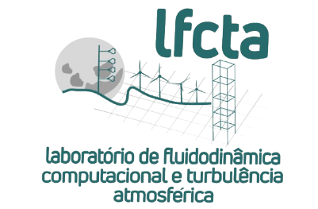

# 🎓 Oportunidade de Mestrado E Doutorado — PPGENG / UNIPAMPA  

**Vaga disponível para o Laboratório de Fluidodinâmica Computacional e Turbulência Atmosférica (LFCTA)**  

### 📢 Chamada Aberta  

Estão abertas as inscrições para o **Mestrado e Doutorado em Engenharia (PPGENG)** na **Universidade Federal do Pampa (UNIPAMPA)**.  
<table border="0" cellpadding="0" cellspacing="0">
  <tr>
    <td style="vertical-align: top; padding-right: 20px;" border="0">
      <h2> Sobre o Laboratório de Fluidodinâmica Computacional e Turbulência Atmosférica - LFCTA </h2>
      
O LFCTA foi criado em 2014, por um grupo de professores da UNIPAMPA – Campus Alegrete, com o nome de Grupos de Estudo em Sistemas Complexos e Aplicações, com o objetivo de desenvolver pesquisas em temas tais como turbulência e teoria do caos. Com a evolução e amadurecimento, o grupo começou a focar em temas de pesquisas mais amplos relacionados com modelagem de numérica de fluídos e o estudo comportamento do escoamento na camada limite atmosférica e suas implicações em diferentes áreas, tais como, previsão de tempo e clima e geração de energia.
      https://https://sites.unipampa.edu.br/lfcta/
      

    </td>
    <td border="0">
      
    </td>
  </tr>
</table>

### 📄 Edital Completo  

📥 [Clique aqui para acessar o edital oficial - Mestrado (PDF)](https://cursos.unipampa.edu.br/cursos/ppeng/files/2025/10/processo_seletivo_mestrado_2026_01.pdf)

📥 [Clique aqui para acessar o edital oficial - Doutado (PDF)](https://cursos.unipampa.edu.br/cursos/ppeng/files/2025/10/selecao-ingresso-doutorado_2026_01.pdf)

  📍 UNIPAMPA — Programa de Pós-Graduação em Engenharia (PPGENG) • Laboratório LFCTA

